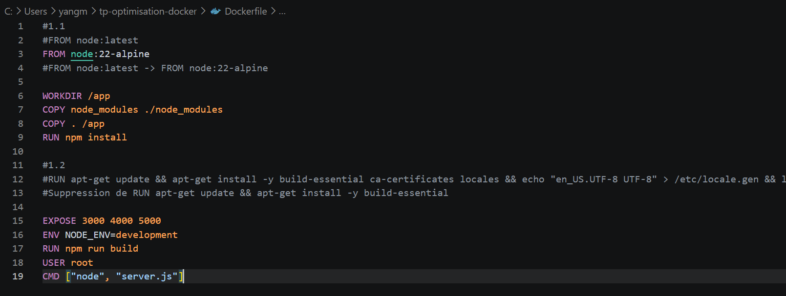
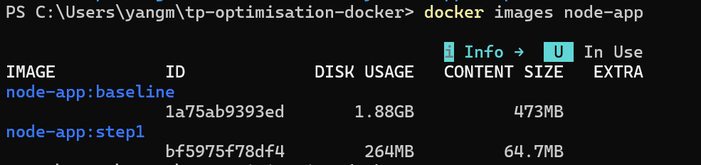
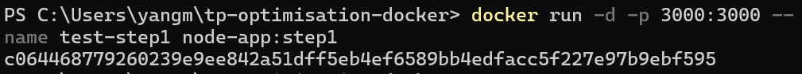
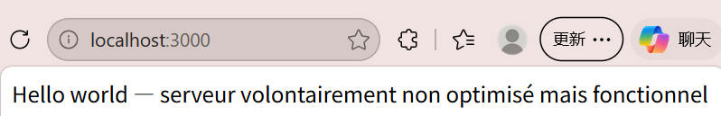

# TP Optimisation Docker

## Objectif
Optimisation progressive d'une application Node.js et de son image Docker
(baseline → version optimisée), avec mesure de l'impact à chaque étape.

## Baseline
**Taille de l'image :** [1.88 GB]

Problèmes identifiés dans le Dockerfile initial :
1. `FROM node:latest` — image Debian complète (~1,1 GB), non reproductible
2. `COPY node_modules` — anti-pattern, dépendances hôte copiées dans l'image
3. `COPY . /app` avant `npm install` — casse le cache des layers
4. `npm install` au lieu de `npm ci --omit=dev` — devDependencies incluses
5. `apt-get install build-essential` — inutile pour du JS pur (+300 MB)
6. `ENV NODE_ENV=development` — mode dev en production
7. `USER root` — conteneur exécuté en root
8. Pas de `.dockerignore` ni de multi-stage build

## Étape 1 — Image de base alpine

### Modifications :

- FROM node:latest → FROM node:22-alpine
- Suppression de RUN apt-get update && apt-get install -y build-essential

### Résultat : 

*Baseline 1.88GB -> étape1 264MB*

*Vérification fonctionnelle après l'Étape 1*

### Pourquoi :

- node:latest repose sur Debian complet (~1,1 GB) et son tag flottant n’est pas reproductible → alpine (~150 MB) + version figée (22)
- apt-get n’existe pas sur alpine (gestionnaire = apk)
- build-essential (gcc, make…) est inutile pour une app 100 % JavaScript