# TP Optimisation Docker

## Objectif
Optimisation progressive d'une application Node.js et de son image Docker
(baseline → version optimisée), avec mesure de l'impact à chaque étape.

## Baseline
**Taille de l'image :** [1.88 GB]

Problèmes identifiés dans le Dockerfile initial :
1. `FROM node:latest` — image Debian complète (~1,1 GB), non reproductible
2. `COPY node_modules` — anti-pattern, dépendances hôte copiées dans l'image
3. `COPY . /app` avant `npm install` — casse le cache des layers
4. `npm install` au lieu de `npm ci --omit=dev` — devDependencies incluses
5. `apt-get install build-essential` — inutile pour du JS pur (+300 MB)
6. `ENV NODE_ENV=development` — mode dev en production
7. `USER root` — conteneur exécuté en root
8. Pas de `.dockerignore` ni de multi-stage build

## Étape 1 — Image de base alpine

### Modifications :

- FROM node:latest → FROM node:22-alpine
- Suppression de RUN apt-get update && apt-get install -y build-essential

### Résultat : 

*Baseline 1.88GB -> étape1 264MB*

*Vérification fonctionnelle après l'Étape 1*

### Pourquoi :

- node:latest repose sur Debian complet (~1,1 GB) et son tag flottant n’est pas reproductible → alpine (~150 MB) + version figée (22)
- apt-get n’existe pas sur alpine (gestionnaire = apk)
- build-essential (gcc, make…) est inutile pour une app 100 % JavaScript

## Étape 2 — node_modules & .dockerignore

### Problème : 
COPY node_modules recopie les dépendances de l’hôte
(Windows) dans une image Alpine → binaires potentiellement incompatibles, contexte de build enflé, aucun .dockerignore ; npm install placé après COPY . . → cache Docker inutilisé

### Modifications :
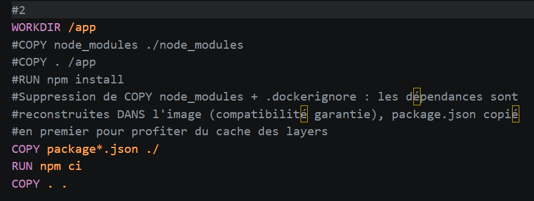
- suppression de COPY node_modules
- ordre COPY package*.json → npm ci → COPY . ., ajout de .dockerignore

### Résultat : 

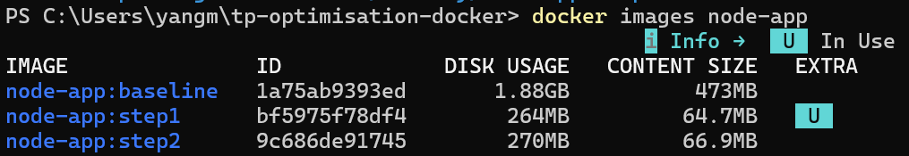
*étape1 264MB -> étape2 270MB*

*mais :
contexte de build réduit de ~Mo à ~Ko, dépendances garanties
compatibles Alpine, cache des layers activé*

Explication : l’objectif de cette étape est la correction et la
vitesse de build, pas le volume : les dépendances sont reconstruites
dans l’image au lieu d’être copiées depuis l’hôte. Le gain de volume
viendra du multi-stage (retrait des devDependencies du runtime).

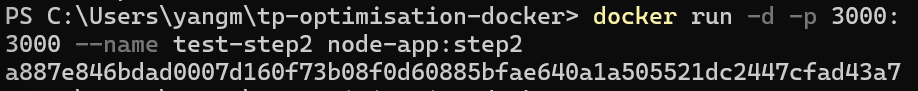

*Vérification fonctionnelle après l'Étape 2*

## Étape 3 — Multi-stage build

### Problème : 
devDependencies + npm run build dans l’image de runtime ;

NODE_ENV=development en production ;

impossible de faire npm ci --omit=dev car le build a besoin des devDependencies

### Modifications :
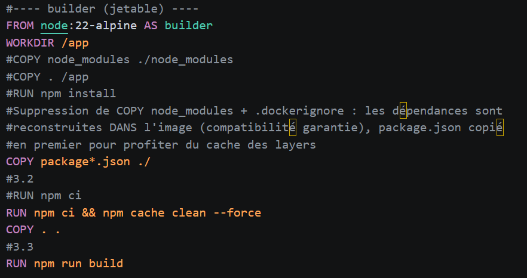
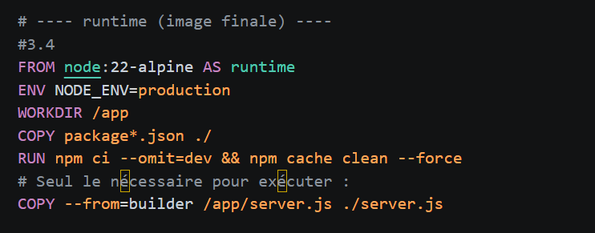
- multi-stage — stage builder (npm ci complet +
build, jetable) / stage runtime (npm ci --omit=dev + NODE_ENV=production, seul server.js est copié depuis le builder)
- npm cache clean --force

### Résultat : 

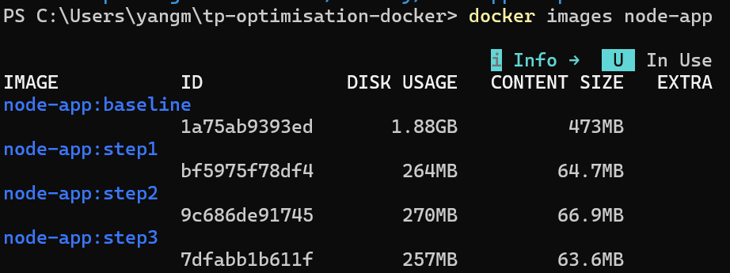
*étape2 270MB -> étape3 257MB*

Explication : le stage builder est jetable — ses devDependencies
et son cache n’existent que pendant le build. L’image finale ne contient
que node:22-alpine + les dépendances de production + server.js.
npm ci --omit=dev devient possible car le build n’est plus dans le
stage runtime.

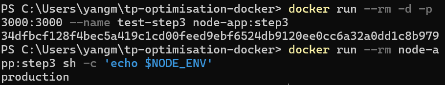

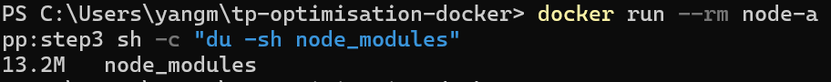
*Vérification fonctionnelle après l'Étape 3*

*NODE_ENV=production vérifié*

*node_modules ：13.2M*

## Étape 4 — Utilisateur non root

### Problème : 
conteneur exécuté en root (défaut Docker) — si le process est compromis, l’attaquant est root sur l’hôte

### Modifications :
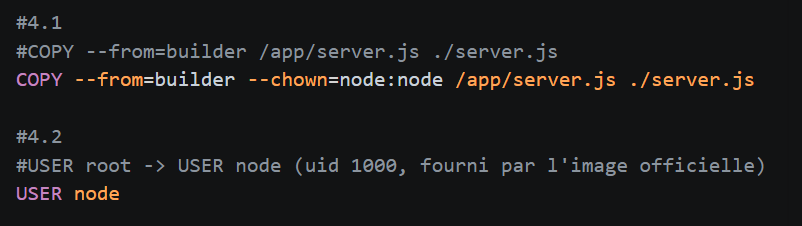
- USER node (uid 1000, fourni par l’image
officielle) + --chown=node:node sur le COPY final

### Résultat : 

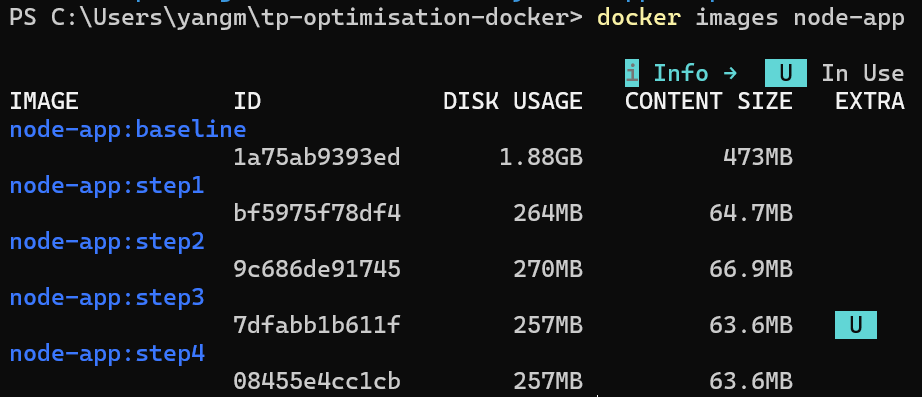
*étape3 257MB -> étape4 257MB*

Explication : USER est une directive d’exécution : elle détermine l’identité (uid) du processus au démarrage du conteneur, mais n’ajoute ni ne retire aucun fichier de l’image. Le contenu (node, node_modules, server.js) étant identique à étape3, le volume reste logiquement à 257 MB. L’absence de gain de taille ici est attendue — le gain de cette étape est sécuritaire, pas volumétrique : si le
processus est compromis, l’attaquant hérite de uid 1000 (node) et non de root sur l’hôte.

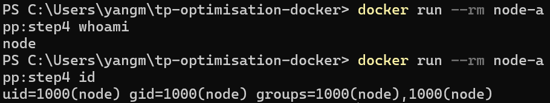
- utilisateur ： node (et non “root”)
- uid=1000(node) gid=1000(node) groups=1000(node)

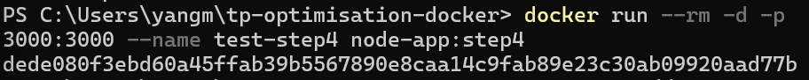

*Vérification fonctionnelle après l'Étape 4*

## Étape 5 — EXPOSE : déclaration fidèle

### Problème : 
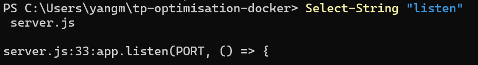
EXPOSE 3000 4000 5000 — l’application n’écoute que sur le port 3000 ; 4000 et 5000 sont des déclarations fantômes

### Modifications :
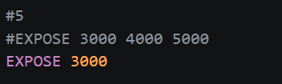
- Suppression des ports 4000 et 5000, on ne déclare que le port réellement écuté

### Résultat : 

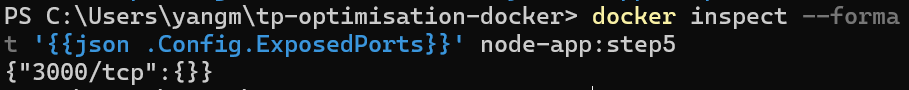

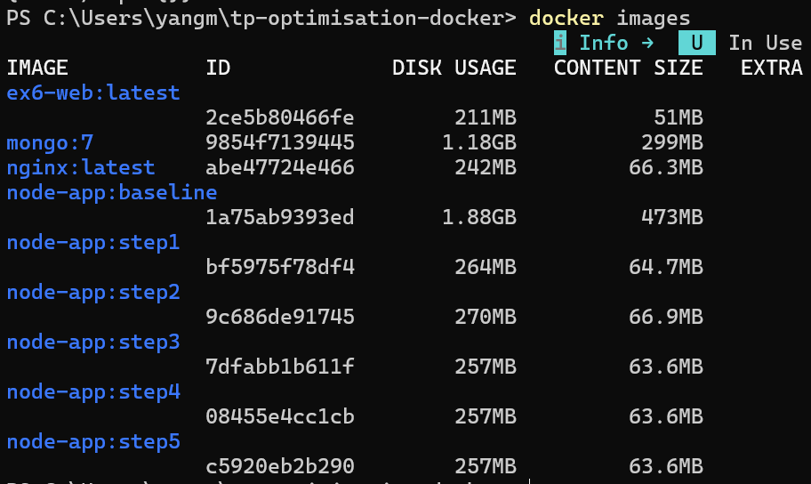
*étape4 257MB -> étape5 257MB*

Explication : EXPOSE ne crée aucune couche et n’ajoute aucun fichier : il ne fait qu’ajouter le port aux métadonnées de l’image (champ ExposedPorts du manifeste). Même raison pour USER node à l’étape 4 — les deux dernières étapes durcissent la déclaration de l’image, pas son poids.

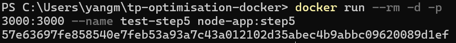

*Vérification fonctionnelle après l'Étape 5*